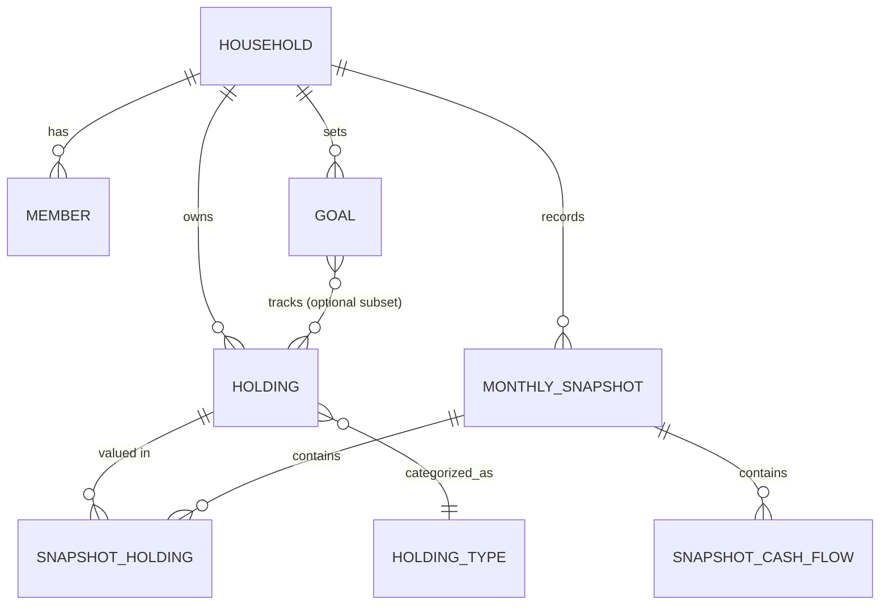

# 02 — Domain Model

Defines the core entities, relationships, and invariants that everything downstream (`03-database-design.md`, `07-calculation-engine.md`, `08-api-design.md`) implements. Resolves the open questions from [00-product-vision.md](00-product-vision.md).

---

## 1. Entity-relationship overview

---

## 2. Entities

### 2.1 Household

The tenant boundary. One Household = one family's data. No cross-household sharing in v1.

| Field | Type | Notes |
|---|---|---|
| `id` | UUID | PK |
| `name` | string | e.g. "The Nguyễn Family" |
| `baseCurrency` | Currency code | e.g. `VND`. Set at creation; changing it later is a v2 concern (requires re-converting all historical snapshots) |
| `checkInDay` | int (1–28) | Day of month used for reminder scheduling |
| `createdAt` | timestamp | |

### 2.2 Member

A person who can log in and act on behalf of the household. Resolves Open Question 1 from `00`.

| Field | Type | Notes |
|---|---|---|
| `id` | UUID | PK |
| `householdId` | UUID | FK → Household |
| `name` | string | |
| `email` | string | unique, used for auth |
| `role` | enum | `OWNER` \| `MEMBER`. Single tier of permissions in v1 — both can edit everything. `OWNER` only matters for household-deletion authority |
| `createdAt` | timestamp | |

### 2.3 HoldingType

Reference data (seeded, not user-created in v1 beyond the "custom" escape hatch from Settings).

| Field | Type | Notes |
|---|---|---|
| `id` | string (slug) | PK, e.g. `cash`, `brokerage`, `crypto`, `real_estate`, `retirement`, `loan`, `credit_card`, `other_asset`, `other_liability` |
| `label` | string | Display name |
| `classification` | enum | `ASSET` \| `LIABILITY` — determines Net Worth sign |
| `isInvestable` | boolean | Included in "Investable Assets" metric (true for brokerage/crypto/retirement; false for cash, real estate, liabilities) |
| `isCash` | boolean | Included in "Cash Position" metric |

Seed set (v1):

| slug | classification | isInvestable | isCash |
|---|---|---|---|
| `cash` | ASSET | false | true |
| `brokerage` | ASSET | true | false |
| `crypto` | ASSET | true | false |
| `real_estate` | ASSET | false | false |
| `retirement` | ASSET | true | false |
| `other_asset` | ASSET | false | false |
| `loan` | LIABILITY | false | false |
| `credit_card` | LIABILITY | false | false |
| `other_liability` | LIABILITY | false | false |

### 2.4 Holding

A place where money is stored — the master record. Resolves Open Question 4 (assets vs. liabilities) and Open Question 6 (archive vs. delete).

| Field | Type | Notes |
|---|---|---|
| `id` | UUID | PK |
| `householdId` | UUID | FK → Household |
| `holdingTypeId` | string | FK → HoldingType |
| `name` | string | e.g. "MSB", "IBKR", "Celesta Rise" |
| `institution` | string, nullable | Optional grouping label separate from name |
| `currency` | Currency code | Native currency this holding is valued in |
| `status` | enum | `ACTIVE` \| `ARCHIVED` |
| `createdAt` | timestamp | |
| `archivedAt` | timestamp, nullable | |

**Delete vs. archive rule:** a Holding may be hard-deleted only if it has zero `SnapshotHolding` rows referencing it (i.e., never appeared in a completed check-in). Otherwise, delete is rejected in favor of archive — this preserves historical snapshot integrity.

### 2.5 MonthlySnapshot

One per household per calendar month. The unit of the "monthly ritual." Resolves Open Question 5 (editability/versioning).

| Field | Type | Notes |
|---|---|---|
| `id` | UUID | PK |
| `householdId` | UUID | FK → Household |
| `periodMonth` | date | Normalized to first-of-month, e.g. `2026-07-01`. **Unique per household** |
| `status` | enum | `DRAFT` \| `COMPLETED` |
| `notes` | text, nullable | Free-text journal entry (e.g. "Returned to Vietnam") |
| `version` | int | Starts at 1, incremented on every edit after completion |
| `completedAt` | timestamp, nullable | Set when status → COMPLETED |
| `updatedAt` | timestamp | Bumped on every edit |
| `createdAt` | timestamp | |

Cached metrics (computed at completion/edit time by the [calculation engine](07-calculation-engine.md), stored for fast timeline/history rendering rather than recomputed on every read):

| Field | Type |
|---|---|
| `netWorthBase` | decimal |
| `investableAssetsBase` | decimal |
| `cashPositionBase` | decimal |
| `passiveIncomeBase` | decimal |
| `savingsRate` | decimal (0–1) |

**Versioning rule:** editing a `COMPLETED` snapshot mutates it in place (per Open Question 5 — no forked timeline entries) and increments `version`. Cached metrics are recomputed on every edit. Field-level audit history is out of scope for v1; `version` + `updatedAt` is the only change signal.

**Draft rule:** starting a check-in creates a `DRAFT` snapshot immediately (not on final submit), so exiting mid-wizard preserves progress (see [01-information-architecture.md](01-information-architecture.md) §3.8).

### 2.6 SnapshotHolding

The value of one Holding at one point in time — the actual "state" record the state-based philosophy is built on.

| Field | Type | Notes |
|---|---|---|
| `id` | UUID | PK |
| `snapshotId` | UUID | FK → MonthlySnapshot |
| `holdingId` | UUID | FK → Holding |
| `value` | decimal | In the holding's native currency |
| `fxRateToBase` | decimal | Rate captured at entry time; `1` if currency == household base currency |
| `valueBase` | decimal | Computed: `value × fxRateToBase`, stored for query performance |

Unique on (`snapshotId`, `holdingId`). Resolves Open Question 2 (multi-currency): each line item carries its own FX rate frozen at entry time, so historical snapshots never silently reflow when rates change later.

### 2.7 SnapshotCashFlow

Monthly income/expense/contribution figures for one snapshot. Modeled as categorized line items (not itemized transactions — stays consistent with the state-based, aggregate-entry philosophy) so Passive Income can be tracked separately from Active Income without a full ledger.

| Field | Type | Notes |
|---|---|---|
| `id` | UUID | PK |
| `snapshotId` | UUID | FK → MonthlySnapshot |
| `category` | enum | `ACTIVE_INCOME` \| `PASSIVE_INCOME` \| `EXPENSE` \| `INVESTMENT_CONTRIBUTION` |
| `label` | string | e.g. "Salary", "Rental Income", "Groceries" — user-defined, free text |
| `amount` | decimal | In base currency directly (income/expenses assumed household-currency; no FX needed here) |

### 2.8 Goal

| Field | Type | Notes |
|---|---|---|
| `id` | UUID | PK |
| `householdId` | UUID | FK → Household |
| `type` | enum | `FIRE` \| `NET_WORTH` \| `HOUSE_FUND` \| `EDUCATION_FUND` \| `CUSTOM` |
| `name` | string | |
| `targetAmount` | decimal | In base currency |
| `targetDate` | date, nullable | If set, pace is measured against it; if null, target date is estimated from current pace |
| `trackingMode` | enum | `NET_WORTH` (tracks the whole household Net Worth metric) \| `HOLDING_SUBSET` (tracks only linked holdings, e.g. a dedicated house-fund account) |
| `status` | enum | `ACTIVE` \| `ACHIEVED` \| `ARCHIVED` |
| `createdAt` | timestamp | |

### 2.9 GoalHolding (join table)

Only populated when `Goal.trackingMode = HOLDING_SUBSET`.

| Field | Type |
|---|---|
| `goalId` | UUID, FK → Goal |
| `holdingId` | UUID, FK → Holding |

### 2.10 What-If Simulation — not persisted (v1)

Per Open Question 9, simulations are computed client-side from ad hoc inputs and a snapshot of current Net Worth; no entity exists for them in v1. Revisit in v2 if "saved scenarios" becomes a requirement (see [09-roadmap.md](09-roadmap.md)).

---

## 3. Key invariants

1. **Net Worth** (base currency) = Σ `valueBase` of `SnapshotHolding` where `HoldingType.classification = ASSET` − Σ where `classification = LIABILITY`.
2. **Investable Assets** = Σ `valueBase` where `HoldingType.isInvestable = true`.
3. **Cash Position** = Σ `valueBase` where `HoldingType.isCash = true`.
4. **Passive Income** = Σ `amount` of `SnapshotCashFlow` where `category = PASSIVE_INCOME`.
5. **Savings Rate** = `(ACTIVE_INCOME + PASSIVE_INCOME − EXPENSE) / (ACTIVE_INCOME + PASSIVE_INCOME)` for the snapshot.
6. One `MonthlySnapshot` per (`householdId`, `periodMonth`) — enforced unique.
7. A `Holding` with any `SnapshotHolding` history cannot be hard-deleted, only archived.
8. `SnapshotHolding.valueBase` is always a stored, not derived-on-read, value — historical snapshots must never change because today's FX rate changed.
9. Creating a new `DRAFT` snapshot copies forward `SnapshotHolding` values and `SnapshotCashFlow` entries from the latest `COMPLETED` snapshot (the "copy last month's data" step) for all currently `ACTIVE` holdings.
10. A `Goal` with `trackingMode = HOLDING_SUBSET` requires at least one `GoalHolding` row; progress is computed by summing only linked holdings' `valueBase` across snapshots instead of whole-household Net Worth.

---

## 4. Deferred to v2 (explicitly out of scope here)

- Field-level audit trail for snapshot edits (who changed what, from what to what).
- Changing a household's base currency after creation.
- Per-member permission tiers (view-only member, etc.).
- Persisted/named What-If scenarios.
