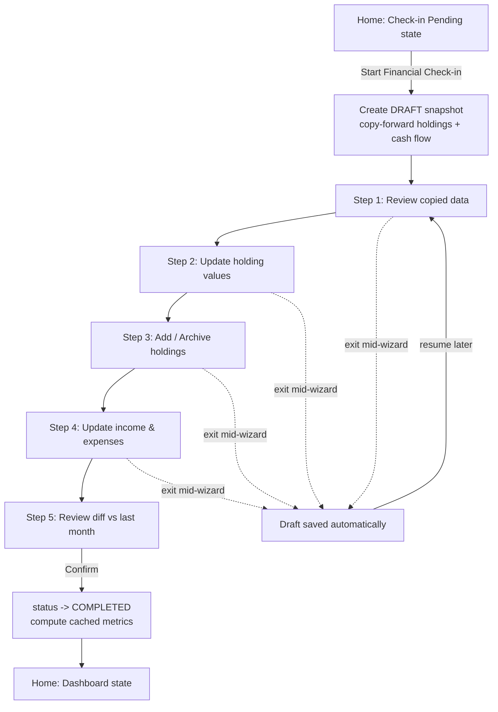

# 04 — User Flows

Concrete step-by-step flows implementing the screens in [01-information-architecture.md](01-information-architecture.md) against the entities in [02-domain-model.md](02-domain-model.md). Each flow states preconditions and postconditions so it can be implemented and tested independently.

---

## 1. Onboarding → first check-in

**Preconditions:** no account exists.
**Postconditions:** Auth.js `User`, `Household`, first `Member` (role `OWNER`), and one `COMPLETED` `MonthlySnapshot` exist.

1. User signs up (email + password, or magic link) → Auth.js creates the **`User`** record. (No `Member` yet — `member.household_id` is `NOT NULL`, so a member can't exist before its household.)
2. Household creation form: household name, base currency, check-in day → creates `Household`, then the first `Member` (`user_id` = the Auth.js user, `role = OWNER`) in the same transaction.
3. Redirect to `/` → empty state: "You haven't done a check-in yet."
4. User clicks "Start Financial Check-in" → enters wizard at `/check-in`, creates a `DRAFT` `MonthlySnapshot` for the current `periodMonth`.
5. **Step 1 (Review) is skipped** — no prior snapshot to copy forward from.
6. **Step 2/3 (Holdings)** starts from zero: user adds each holding (name, type, institution, currency, value) one at a time. This is the same "Add Holding" action used later for ad hoc additions (§4).
7. **Step 4 (Income & Expenses)**: user enters at least one `ACTIVE_INCOME` line and, optionally, `EXPENSE` / `PASSIVE_INCOME` / `INVESTMENT_CONTRIBUTION` lines.
8. **Step 5 (Review & Complete)**: summary of everything entered (no "vs. last month" diff, since there's no prior month) → confirm.
9. Snapshot `status → COMPLETED`, `completedAt` set, cached metrics computed.
10. Redirect to `/` → now renders dashboard state (Home Experience B).

---

## 2. Monthly check-in (returning household)

**Preconditions:** at least one `COMPLETED` snapshot exists; no snapshot exists yet for the current `periodMonth`.
**Postconditions:** a new `COMPLETED` `MonthlySnapshot` exists for the current period.

1. Household lands on Home; since no snapshot exists for this `periodMonth`, Home renders **Check-in Pending**.
2. User clicks "Start Financial Check-in" → system creates a `DRAFT` `MonthlySnapshot`, then copy-forwards (domain invariant 9):
   - a `snapshot_holding` row per currently `ACTIVE` `Holding`, with `value` = last completed snapshot's value for that holding. A holding with **no prior value** (added since the last check-in) is carried as an **empty/unset value that requires entry** — rendered as `—`, not `0` — so the user is prompted for a first figure rather than silently defaulting to zero (consistent with Flow 4 §5).
   - `snapshot_cash_flow` rows copied from last month as defaults (income/expenses tend to repeat; user edits rather than re-enters from scratch).
3. **Step 1 — Review:** user sees the copied-forward figures as a starting point.
4. **Step 2 — Update Holdings:** user edits `value` per holding inline (most holdings: change one number, e.g. account balance).
5. **Step 3 — Add / Archive:** user adds any new holdings (§4) or archives any closed ones (§5) directly inside the wizard.
6. **Step 4 — Income & Expenses:** user edits the copied-forward cash flow line items or adds new ones.
7. **Step 5 — Review & Complete:** shows a diff view (this month vs. last month) for Net Worth, per-holding deltas, and cash flow — the moment that answers "did we stay on track?" User confirms.
8. Snapshot `status → COMPLETED`; cached metrics computed via the [calculation engine](07-calculation-engine.md).
9. Redirect to Home, now in **Dashboard state**.

**Exit mid-wizard:** the `DRAFT` row already exists in the DB from step 2, so navigating away simply leaves it as-is. Home's CTA changes from "Start Financial Check-in" to "Resume Check-in" when a `DRAFT` snapshot exists for the current period. Re-entering the wizard reopens at the last-visited step.

**Abandon draft entirely:** an explicit "Discard and restart" action in the wizard hard-deletes the `DRAFT` row (§5 of `03-database-design.md`) and re-runs step 2's copy-forward from scratch.

---

## 3. Reminder-triggered entry

**Preconditions:** `Household.checkInDay` has passed for the current month and no snapshot exists yet for that period.
**Postconditions:** same as Flow 2.

1. Scheduled job (see [09-roadmap.md](09-roadmap.md)) checks, daily, which households have `checkInDay <= today` and no snapshot for the current period.
2. Sends an email (v1) — "Your monthly financial check-in is ready" — linking directly to `/check-in`.
3. User clicks through → resumes at Flow 2, step 2 (draft creation), since a `DRAFT` may or may not already exist depending on whether they'd started manually.
4. If ignored, a second reminder fires 7 days later (single follow-up only — avoid nagging, consistent with the product's non-judgmental philosophy).

---

## 4. Add a new holding (ad hoc, from Assets or mid check-in)

**Preconditions:** household is authenticated.
**Postconditions:** new `ACTIVE` `Holding` exists; may or may not have a value yet depending on entry point.

1. User clicks "Add Holding" from `/assets` **or** from Check-in Step 3.
2. Form: name, holding type (dropdown = global seed types + this household's custom types), institution (optional), denomination (fiat code or crypto ticker), and amount **in that native unit** (a fiat balance, or a coin quantity like `0.5` BTC). When the denomination ≠ the household base currency, the form also captures a per-unit price (FX rate or coin price) — see [07-calculation-engine.md](07-calculation-engine.md) §1.6.
3. System creates the `Holding` row (`status = ACTIVE`).
4. **If a `DRAFT` snapshot currently exists** for the household: also create a `snapshot_holding` row immediately with the entered value, so it's included when the check-in is completed.
5. **If no `DRAFT` snapshot exists** (added between check-ins, e.g. mid-month): the holding exists but has zero `snapshot_holding` history. It renders on `/assets` as "not yet valued this cycle." The next check-in's copy-forward step (Flow 2, step 2) includes it with a prompt to enter its first value, rather than a copied number, since there's nothing to copy forward.

---

## 5. Archive a holding

**Preconditions:** `Holding.status = ACTIVE`.
**Postconditions:** `Holding.status = ARCHIVED`; historical snapshots unchanged.

1. User selects "Archive" on a holding (from `/assets` or Check-in Step 3) — e.g., a closed bank account.
2. Confirmation dialog clarifies: "This holding will no longer appear in future check-ins. Its value in past snapshots is preserved." (Directly addresses Open Question 6 from `00` at the UI level, so users aren't surprised by the semantics.)
3. `Holding.status → ARCHIVED`, `archivedAt = now()`.
4. If archived while a `DRAFT` snapshot is open and the holding has a `snapshot_holding` row in that draft, the row is removed from the draft (it won't be counted in this check-in's totals) unless the user explicitly wants its final value recorded — UI should ask "record its final value before archiving?" as a one-time exception, writing that value into the current draft's `snapshot_holding` before removing it from future copy-forwards.

**Delete instead of archive:** offered only when `Holding` has zero `snapshot_holding` rows across all snapshots (domain invariant 7) — i.e., it was added and removed within the same still-`DRAFT` cycle, never completed. Otherwise the "Delete" option is disabled in favor of "Archive."

---

## 6. Create a goal

**Preconditions:** none required — a goal can be created at any time. Pace/projection simply reports `insufficient-data` until two `COMPLETED` snapshots exist to derive a trend from (see [07-calculation-engine.md](07-calculation-engine.md) §2.3); progress % still shows from the first snapshot.
**Postconditions:** new `Goal` exists, visible on `/goals` with computed progress.

1. User clicks "New Goal" on `/goals`.
2. Choose type: FIRE / Net Worth / House Fund / Education Fund / Custom.
3. Enter target amount, optional target date.
4. Choose tracking mode:
   - **Whole Net Worth** (default for FIRE/Net Worth goals) — no further input.
   - **Specific holdings** (typical for House Fund/Education Fund) — user selects one or more existing `Holding`s to link via `GoalHolding`.
5. System creates the `Goal`. Progress is computed immediately from historical snapshots (see [07-calculation-engine.md](07-calculation-engine.md) for the pace/projection formula) — no waiting for a new check-in.
6. Goal appears on `/goals` with progress bar, current pace, and estimated completion date (or on-track/behind indicator if `targetDate` was set).

---

## 7. Run a What-If simulation

**Preconditions:** none (works even with zero snapshots, using manual inputs).
**Postconditions:** none persisted — output exists only in the browser session (Open Question 9, deferred to v2 for saved scenarios).

1. User opens `/what-if`, selects a simulation type (Future Value, Compound Interest, Mortgage, Retirement Projection, Goal Projection).
2. Form pre-fills `Current Amount` from the household's latest `netWorthBase` where relevant (e.g. Retirement Projection), otherwise blank.
3. User adjusts inputs: Target Amount, Current Amount, Monthly Contribution, Expected Annual Return (+ loan-specific inputs for Mortgage — see `07`).
4. Output recalculates live, client-side, on every input change: Estimated Time, Target Date, Growth Chart.
5. No save action in v1. Navigating away discards the scenario.

---

## 8. Edit a past snapshot

**Preconditions:** a `COMPLETED` `MonthlySnapshot` exists and contains an error the household wants to correct.
**Postconditions:** snapshot updated in place, `version` incremented, cached metrics recomputed, **all dependent views refresh** (see step 4).

1. User opens `/timeline/[snapshotId]` for the month in question.
2. Clicks "Edit this snapshot" → same field-level editing UI as the check-in wizard's steps 2/4, but scoped to this one snapshot (no copy-forward, no step navigation).
3. User corrects the value(s) → confirms.
4. System recomputes that snapshot's cached metrics, increments `version`, bumps `updatedAt`. Because Goals and later Timeline entries derive pace from historical snapshots, this can shift:
   - Goal progress/pace for any `Goal` whose projection window includes this month.
   - The "change since last month" figure shown on the *next* snapshot after this one (Home dashboard reads the two most recent snapshots).
   - No cascading recalculation of unrelated months' cached figures — only this snapshot's own row changes; comparisons are computed at read time from whichever two snapshots are being compared.
5. Timeline entry shows a subtle "edited" indicator (from `version > 1`) without a full diff/audit view (deferred to v2 per domain model §4).

---

## 9. Flow coverage vs. domain model

| Flow | Entities touched |
|---|---|
| 1. Onboarding | Household, Member, MonthlySnapshot, Holding, SnapshotHolding, SnapshotCashFlow |
| 2. Monthly check-in | MonthlySnapshot, SnapshotHolding, SnapshotCashFlow |
| 3. Reminder | (read-only trigger) |
| 4. Add holding | Holding, SnapshotHolding |
| 5. Archive holding | Holding, SnapshotHolding |
| 6. Create goal | Goal, GoalHolding |
| 7. What-If | (none persisted) |
| 8. Edit past snapshot | MonthlySnapshot, SnapshotHolding, SnapshotCashFlow |
